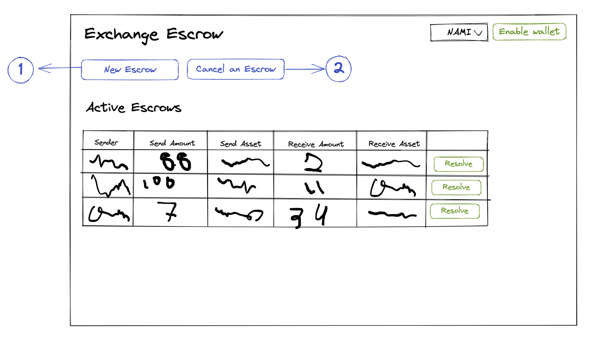
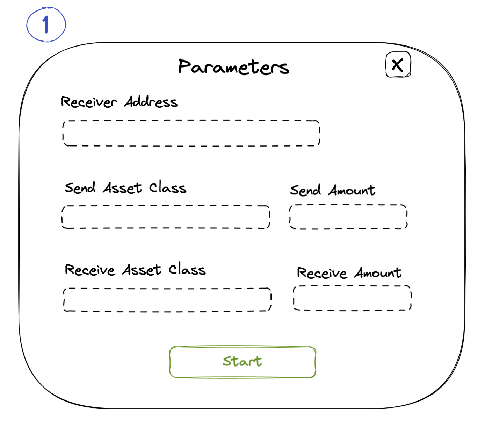

# Simple Escrow dApp Frontend Design

In this document we share a quick mock-up for the UI/UX of the Exchange Escrow. In this first version there is a main screen where the user can execute most actions. It also includes two pop-up screens for the Start and Cancel operations.

References:

- The **Rounded** rectangles are buttons.
- The **Dotted** rectangles are text fields where the user can input information.
- The **Blue** colored buttons open a new window.
- The **Green** colored buttons trigger OffChain functions in the backend.

## Main Screen

This main screen allows the user to connect their wallet to the contract. Then they can either start a new escrow, and cancel or resolve an existing escrow.

Once a user connects their wallet to the contract, a list of escrows they can resolve will populate automatically. There’s a **reload** button to update the table with the current escrows. This button calls the `reload` endpoint from the OffChain code. Each escrow has a **resolve** button that calls the `resolve` endpoint from the Offchain code. Once an escrow is resolved, it is removed from the table.

To start or cancel, a pop-up window appears, described below.

## Start

When the button **New Escrow** in the main screen is triggered, this window is opened. The user completes the text fields with the start parameters and clicks the **Start** button. This button calls the `start` endpoint from the OffChain code in the backend.
After the **Start** button is clicked, the pop-up window is dismissed. The window can also be dismissed by clicking the **cross** button on the top right corner.

## Cancel

When the **Cancel Escrow** button in the main screen is triggered, this window is opened. When the user completes the text field with the receiver address and clicks the **search** button, the table is completed with all the information about escrows that the user has with the receiver address. Then the user clicks the **Cancel** button that triggers the `cancel` endpoint on the OffChain code. The window can be dismissed by clicking the **cross** button on the top right corner.