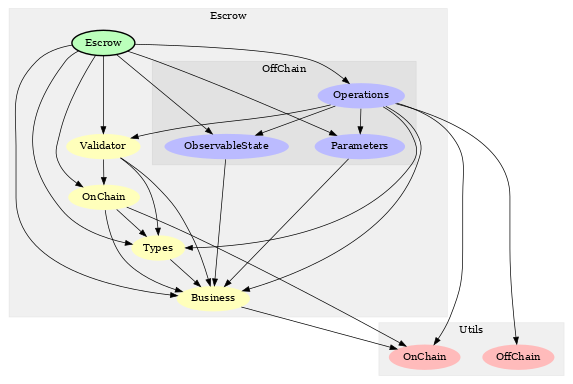

Modules Design
==============

The core part of a dApp implementation consists of the on-chain validator and
the off-chain code in charge of building the transactions to be submitted
for each operation.
In this approach both validator and off-chain code are implemented in Haskell,
allowing to share core pieces of code.

In the previous section we presented a high level description of the PAB service
design. Now we go into more details, showing the actual Haskell modules.
The entire service is implemented as a cabal project, composed of a library,
a tests suite and some mostly boilerplate for building the executable that
will run the web server.

The dependency graph exhibits the organization of the library. It consists
of the :code:`Escrow` library itself, which contains the relevant implementation
of the dApp, and :code:`Utils`, which are common for any dApp (and
probably will be released as part of a separate library soon).

The :code:`Escrow` implementation is divided into three main components:
`Business`, `OnChain` and `OffChain`. 
The first one is implemented in a single module, :code:`Business`,
where we define the core logic for representing the state of the
dApp and how it's changed on each operation. The corresponding data type
representation of that state, the relevant functions for
manipulating it, and any checks that will be done both off-chain and on-chain
are located here.
Given that this module is used in the validator implementation,
the `Plutus Prelude` must be used instead of the standard `Haskell Prelude`.

The :code:`OnChain` module contains the validator implementation, written
in Haskell. The :code:`Validator` module contains the code for compiling from
Haskell to Plutus core, and it's mainly boilerplate.

We propose two submodules inside :code:`OffChain`. :code:`Interface` contains the
data-types corresponding to the `Observable State` and the `Schemas`,
that define the API for interacting with the client side of the dApp.
:code:`Operations` contains the core off-chain code for querying the blockchain
and building the transactions. It depends on `Contract Monad` and `Constraints Library`.

Finally, in :code:`Types` module we define the type definitions corresponding to
the validator `Parameter`, the `Datum` and `Redeemer`.

Regarding the :code:`Utils`, we have :code:`OnChain` and :code:`OffChain` utilities, together
with :code:`WalletAddress`, which contains a simplified version of the Ledger type `Address`.
